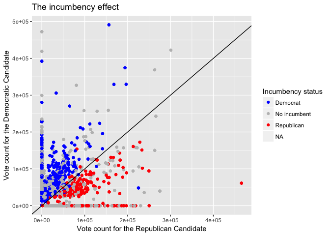

Deliverables
================
EJ Arce
5/4/2017

Forecasting California legislative election results
---------------------------------------------------

Forecasting elections is critical to the campaign strategies of candidates running for office. For example, a US presidential candidate needs 270 electoral votes to win an election, so they must efficiently allocate campaign resources to ensure victories in as many states as possible. Thus, it is important to know in which states the race is tight so they can focus campaign efforts on those states, while ignoring states that do not include tight races. Considering that much of the forecasting field has focused on US elections, our project focuses on forecasting election results for the California state legislature.

Our forecasting goal involves building a model that uses different covariates to predict the probability that a given California district will elect a democratic official in a two-party system. Such covariates include presidential approval, strength of the economy, the incumbency status of the seat up for election, and others. To do achieve such a model involves obtaining (messy) data from various sources. Although you will not be asked to build and test a model (certainly forecasting elections involve higher level modelling). The following exercises will help you understand the process of model building, starting from importing and cleaning messy datasets.

-   How much does incumbency affect election results?
    -   Do incumbents generally recapture their seat?
-   Do districts usually vote according to the same party for which they voted previously?
-   Is voting behavior for national offices (such as offices of the president, governor, and US senators) a good predictor for voting behavior at the state legislative level?

The exercises below will help answer these questions. To complete the exercises, you will need to use the RCurl, dplyr, tidyr, and ggplot2.

Exercises
---------

### Exericse 1

Import the data using the following code

``` r
econ <-
  read.csv(text = getURL("https://raw.githubusercontent.com/ds-elections/state-forecasting-alpha/master/CleanDeliverableData/econ_state.csv"), header = TRUE)
leg_results <-
  read.csv(text = getURL("https://raw.githubusercontent.com/ds-elections/state-forecasting-alpha/master/CleanDeliverableData/leg_results.csv"), header = TRUE)
us_results <-
  read.csv(text = getURL("https://raw.githubusercontent.com/ds-elections/state-forecasting-alpha/master/CleanDeliverableData/us_results.csv"), header = TRUE)
```

The leg\_results and us\_results datasets are fully clean. Each observation shows voting totals and covariate data for a single chamber district. The econ dataset shows the national average real personal income after each quarter since 1965.

-   Merge leg\_results and us\_results together.
-   Tidy the econ dataset so that each observation shows quarterly changes in a year. Then calculate for a weighted change in income so that the highest weight is attributed to the most recent quarterly change, and the lowest to the least recent quarterly change.
    -   (Hint: Elections are in November, so the most recent quarterly change occured from March through June)
-   Merge the econ dataset with the merged results dataset.

### Exercise 2

Reproduce the plot below

    ## Warning: Removed 4400 rows containing missing values (geom_point).


