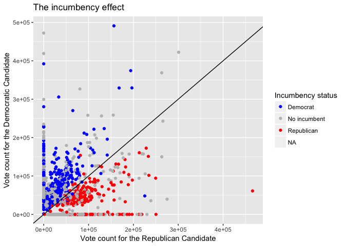

Deliverables
================
EJ Arce
5/4/2017

Forecasting California legislative election results
---------------------------------------------------

Forecasting elections is critical to the campaign strategies of candidates running for office. For example, a US presidential candidate needs 270 electoral votes to win an election, so they must efficiently allocate campaign resources to ensure victories in as many states as possible. Thus, it is important to know in which states the race is tight so they can focus campaign efforts on those states, while ignoring states that do not include tight races. Considering that much of the forecasting field has focused on US elections, our project focuses on forecasting election results for the California state legislature.

Our forecasting goal involves building a model that uses different covariates to predict the probability that a given California district will elect a democratic official in a two-party system. These covariates involve data from two different levels: the national and legislative district levels. Potential covariates involving data from the national level include presidential approval, strength of the economy and others. Some potential covariates involving data from the legislative district level include incumbency status of the seat up for election, vote totals from each party, and others. The achievement of such a model involves obtaining (messy) data from various sources. Although you will not be asked to build and test a model (certainly forecasting elections involve higher level modeling), the following exercises will help you understand the process of model building, starting from importing and cleaning messy datasets.

-   How much does incumbency affect election results?
    -   Do incumbents generally recapture their seat?
-   Do districts usually vote according to the same party for which they voted previously?
-   Is voting behavior for national offices (such as offices of the president, governor, and US senators) a good predictor for voting behavior at the state legislative level?

The exercises below will help answer these questions. To complete the exercises, you will need to use the RCurl, dplyr, tidyr, and ggplot2.

Exercises
---------

### Exericse 1

Import the data using the following code

``` r
econ <-
  read.csv(text = getURL("https://raw.githubusercontent.com/ds-elections/state-forecasting-alpha/master/CleanDeliverableData/econ_state.csv"),
           header = TRUE)[,-1]
leg_results <-
  read.csv(text = getURL("https://raw.githubusercontent.com/ds-elections/state-forecasting-alpha/master/CleanDeliverableData/leg_results.csv"), header = TRUE)[,-1]
us_results <-
  read.csv(text = getURL("https://raw.githubusercontent.com/ds-elections/state-forecasting-alpha/master/CleanDeliverableData/us_results.csv"), header = TRUE)[,-1]
```

The leg\_results and us\_results datasets are fully clean. Each observation shows voting totals and covariate data for a single chamber district. The econ dataset shows the national average real personal income after each quarter since 1965.

-   Merge leg\_results and us\_results together.
-   Tidy the econ dataset so that each observation shows quarterly changes in a year. Then calculate for a weighted change in income so that the highest weight is attributed to the most recent quarterly change, and the lowest to the least recent quarterly change.
    -   (Hint: Elections are in November, so the most recent quarterly change occured from March through June)
-   Merge the econ dataset with the merged results dataset to reproduce the dataset below.

``` r
head(results)
```

    ##   year chamber District   Dem Repub incumbency incumbentparty dummyparty
    ## 1 1974      HS        1    NA    NA         NA             NA         NA
    ## 2 1974      HS        2    NA    NA         NA             NA         NA
    ## 3 1974      HS        3 41972     0          0              0          1
    ## 4 1974      HS        4     0 36820          0              0         -1
    ## 5 1974      HS        5 45873     0          0              0          1
    ## 6 1974      HS        6 64472 27665          1              1          0
    ##   Prez_Dem Prez_Repub Gub_Dem Gub_Repub US_Sen_Dem US_Sen_Repub
    ## 1       NA         NA   49033     45113      54624        35815
    ## 2       NA         NA   51300     41867      58658        30320
    ## 3       NA         NA   41675     48068      49590        35463
    ## 4       NA         NA   43442     38605      54781        25016
    ## 5       NA         NA   42013     38264      50049        27862
    ## 6       NA         NA   49335     43671      59964        30545
    ##   US_Sen2_Dem US_Sen2_Repub      I     II    III   IV I_IIpercent
    ## 1          NA            NA 1204.4 1230.4 1266.6 1296  0.02158751
    ## 2          NA            NA 1204.4 1230.4 1266.6 1296  0.02158751
    ## 3          NA            NA 1204.4 1230.4 1266.6 1296  0.02158751
    ## 4          NA            NA 1204.4 1230.4 1266.6 1296  0.02158751
    ## 5          NA            NA 1204.4 1230.4 1266.6 1296  0.02158751
    ## 6          NA            NA 1204.4 1230.4 1266.6 1296  0.02158751
    ##   II_IIIpercent III_IVpercent IV_Ipercent perc_change incumb_party_name
    ## 1    0.02440763    0.03321739  0.01363407  0.02228786              <NA>
    ## 2    0.02440763    0.03321739  0.01363407  0.02228786              <NA>
    ## 3    0.02440763    0.03321739  0.01363407  0.02228786      No incumbent
    ## 4    0.02440763    0.03321739  0.01363407  0.02228786      No incumbent
    ## 5    0.02440763    0.03321739  0.01363407  0.02228786      No incumbent
    ## 6    0.02440763    0.03321739  0.01363407  0.02228786          Democrat

### Exercise 2

-   Reproduce the plot below to capture how incumbency is related to the outcome of legislative elections. To understand the dataset, we need to define a few variables:
    -   Dem = Total votes awarded to the democractic legislative candidate
    -   Repub = Total votes awarded to the republican legislative candidate
    -   incumbentparty = -1 if the election includes a republican incumbent, 1 if the election includes a democratic incumbent, and 0 if no incumbent is included

``` r
plot1
```

    ## Warning: Removed 1100 rows containing missing values (geom_point).



-   Other than a change in political views, what do you think could be a cause for the incumbent party losing the election (i.e. a Republican receiving more votes in an election where the Democratic party was the incumbent party)? Does the data account for this? (hint: think about the property of legislative districts)

-   The advantage of being an incumbent seems to diminish over time. How would you manipulate the plot to verify this trend?
