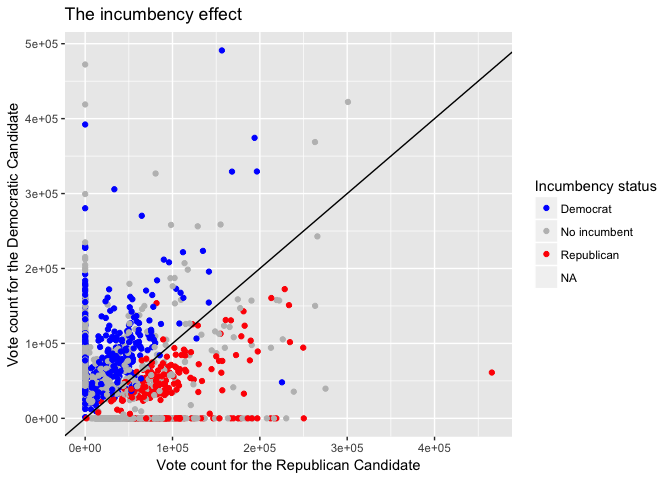
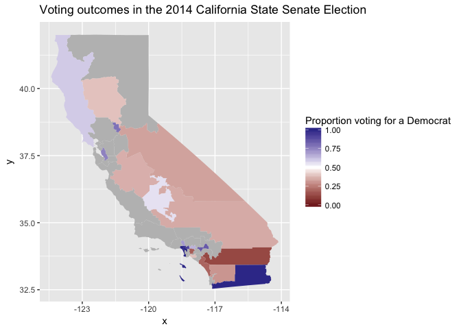

Forecasting the 2018 California Legislative Election
================
EJ Arce
4/2/2017

### Importing election results data

We are importing three datasets and we will eventually join them. LegResults6814 consists of every candidate who ran for a seat in the California State Legislature from 1968 to 2014. LegResults16 includes such candidates who ran in 2016. Threeoffices includes the voting totals for three US offices (Presidential, Gubernatorial, and US Senate) in each of the California senatorial and assembly districts, from 1966 to 2016. This dataset previously consisted of three separate datasets, which Jonathan and I cleaned in R or excel, to create threeoffices.

``` r
LegResults6814 <- read.dta("~/Desktop/state-forecasting-alpha/032_StateLegForecast_CAcopy/SLERs1967to2015_20160912b_CA.dta")

LegResults16 <- read_excel("~/Desktop/state-forecasting-alpha/032_StateLegForecast_CAcopy/001_CA2016GenOfficecopy.xls")

threeoffices <- read_excel("~/Desktop/state-forecasting-alpha/032_StateLegForecast_CAcopy/threeoffices662016copy.xlsx")
```

### Cleaning election results data

For both datasets, we want each observation to represent a given chamber's district's voting totals for both national and state legislative offices, each office including a democratic or republican candidate. It is certainly possible that some candidates for a legislative office ran unopposed or against a third-party candidate, resulting in some blank entries.

``` r
# Selecting and renaming variables of interest, and filtering the dataset to only include democratic and republican candidates. 

LegResults6814 <- LegResults6814 %>%
  select(v05, v07, v09z, v21, v22, v23) %>%
  rename(year = v05,
         chamber = v07,
         District = v09z,
         party = v21,
         incumbency = v22,
         votes = v23) %>%
  filter(party == c(100, 200))
LegResults6814$chamber <- ifelse(LegResults6814$chamber == 8, "SEN", "HS")
LegResults6814$party <- ifelse(LegResults6814$party == 100, "Dem", "Repub")
LegResults6814 <- aggregate(x = LegResults6814["votes"], by = LegResults6814[c("year", "chamber", "District", "party", "incumbency")], sum)

# Coding dummy variables prez_party (1 if the president is a Democrat, -1 if the president is a Republican) and mid_penalty (1 if the president is a Democrat, -1 if the president is a Republican, 0 if the year includes a presidential election).

LegResults6814$prez_party <- ifelse(LegResults6814$year %in% c(1968, 1978,1980,1994,1996,1998,2000,2010,2012,2014,2016), 1, -1)
LegResults6814$mid_penalty <- ifelse(LegResults6814$year %in% c(1968,1972,1976,1980,1984,1988,1992,1996,2000,2004,2008,2012), 0, ifelse(LegResults6814$year %in% c(1970,1974,1982,1986,1990,2002,2006), -1, 1))

# Coding for dummy variable incumbent (1 if the seat up for election is held by a democrat, -1 if held by a Republican, 0 if the seat is open).

LegResults6814 <- LegResults6814  %>%
  mutate(dummyparty = ifelse(party == "Dem", 1, -1)) %>%
  mutate(incumbent = dummyparty * incumbency) %>%
  spread(key = party, value = votes)
LegResults6814[is.na(LegResults6814)] <- 0

# Repeating the same steps for LegResults16

LegResults16 <- LegResults16 %>%
  select(v05, v07, v09, partyoriginal, v23, incumbency) %>%
  rename(year = v05,
         chamber = v07,
         District = v09,
         party = partyoriginal,
         votes = v23) %>%
  filter(party == c("Democratic", "Republican"))
LegResults16$chamber <- ifelse(LegResults16$chamber == 8, "SEN", "HS")
LegResults16$party <- ifelse(LegResults16$party == "Democratic", "Dem", "Repub")
LegResults16 <- aggregate(x = LegResults16["votes"], by = LegResults16[c("year", "chamber", "District", "party", "incumbency")], sum)
LegResults16 <- LegResults16  %>%
  mutate(dummyparty = ifelse(party == "Dem", 1, -1)) %>%
  mutate(incumbent = dummyparty * incumbency) %>%
  mutate(prez_party = 1,
         mid_penalty = 0) %>%
  spread(key = party, value = votes)
LegResults16[is.na(LegResults16)] <- 0

head(LegResults6814)
```

    ##   year chamber District incumbency prez_party mid_penalty dummyparty
    ## 1 1968      HS        2          0          1           0          1
    ## 2 1968      HS        2          1          1           0         -1
    ## 3 1968      HS        3          1          1           0          1
    ## 4 1968      HS        5          0          1           0         -1
    ## 5 1968      HS        6          0          1           0          1
    ## 6 1968      HS        6          1          1           0         -1
    ##   incumbent   Dem Repub
    ## 1         0 22297     0
    ## 2        -1     0 68566
    ## 3         1 50654     0
    ## 4         0     0 34854
    ## 5         0 24515     0
    ## 6        -1     0 71799

``` r
head(LegResults16)
```

    ##   year chamber District incumbency dummyparty incumbent prez_party
    ## 1 2016      HS        1          1         -1        -1          1
    ## 2 2016      HS        2          1          1         1          1
    ## 3 2016      HS        3          0          1         0          1
    ## 4 2016      HS        3          1         -1        -1          1
    ## 5 2016      HS        4          0         -1         0          1
    ## 6 2016      HS        4          0          1         0          1
    ##   mid_penalty    Dem  Repub
    ## 1           0      0 197166
    ## 2           0  32781      0
    ## 3           0 109521      0
    ## 4           0      0 178787
    ## 5           0      0 100170
    ## 6           0 176279      0

We have selected variables of interest and created new variables that will be useful for our model. Each observation still represents how a district voted for each candidate, so we need to aggregate the votes in the republican and democrat candidate columns so that each observation represents how a district voted for both parties' candidates.

``` r
# Aggregating rows by votes so that our LegResults 6814 dataset is now a district's legislative election

LegResults6814 <- aggregate(x = LegResults6814[c("Dem", "Repub", "incumbent")],
                            by = LegResults6814[c("year",
                                                  "chamber",
                                                  "District",
                                                  "prez_party",
                                                  "mid_penalty")],
                            sum)

LegResults16 <- aggregate(x = LegResults16[c("Dem", "Repub", "incumbent")],
                          by = LegResults16[c("year",
                                              "chamber",
                                              "District",
                                              "prez_party",
                                              "mid_penalty")],
                          sum)
```

Our dataset on voting totals for presidential, gubernatorial, and US Senate offices was mostly tidy, and any modifications to it were made in excel. We now only need to select the variables of interest, remove unnecessary rows (some rows contained sidenotes for the data), and rename the district column to match with our legislative results dataset.

``` r
threeoffices <- threeoffices %>%
  filter(Dummy1 == 1) %>%
  select(year, chamber, dist, (17:24)) %>%
  rename(District = dist)
```

Now both datasets are clean, and we will join them soon. However, first we need to add data on presidential approval ratings and percent change in real income (courtesy of Gallup and the Department of Commerce). Both datasets were collected at the national level.

### Importing and cleaning presidential approval and economy strength data

``` r
Econ_State <- read_excel("~/Desktop/state-forecasting-alpha/032_StateLegForecast_CAcopy/econ-strength.xls")
PrezApprove <- read_excel("~/Desktop/state-forecasting-alpha/032_StateLegForecast_CAcopy/Gallup_Prez_Approv_1966to2016.xlsx")

PrezApprove <- PrezApprove %>%
  select(Year, Approve) %>%
  rename(year = Year)

# For percent change in real income, we are using Dr. Klarner's weighted percent change formula. This includes attributing the highest weight to the quarter that just passed (January through March) and the lowest weight to the most outdated quarter (April through June of the previous year). The reason we are doing this is because we expect that voters focus more on how the economy has changed now, and less 10 months ago. First, we need to measure percent change for each quarter. Our dataset only gives raw income values, so the first mutation creates percent changes for each quarter, and our second mutation creates our weighted annual percent change.

Econ_State <- Econ_State %>%
  spread(key = Quarter, value = Income) %>%
  mutate(I_IIpercent = (II-I)/I,
         II_IIIpercent = (lag(III)-lag(II))/lag(II),
         III_IVpercent = (lag(IV)-lag(III))/lag(III),
         IV_Ipercent = (I - lag(IV))/lag(IV)) %>%
  mutate(perc_change = (4*I_IIpercent +
                        3*IV_Ipercent +
                        2*III_IVpercent +
                        IV_Ipercent)/10) %>%
  rename(year = Year)
```

### Joining legislative elections data with threeoffices, and joining Econ\_State and PrezApprove to Results

``` r
# First joining the legislative results from 2016 to legislative results from 1968 through 2014.

LegResults <- full_join(LegResults16, LegResults6814, by = c("year", "chamber", "District", "prez_party", "mid_penalty", "Dem", "Repub", "incumbent"))

# Joining the entire legislative results to US offices results.

Results <- full_join(LegResults, threeoffices, by = c("year", "chamber", "District"))

# Adding another incumbent variable, this time to explicitly describe which party holds the incumbency. Also adding a categorical variable Leg_winner to represent which party captured the legislative seat.

Results <- Results %>%
  rename(Leg_Dem = Dem, Leg_Repub = Repub) %>%
  mutate(incumb_party = ifelse(incumbent == 1, "Democrat", ifelse(incumbent == 0, "No incumbent", "Republican")),
         Leg_winner = ifelse(Leg_Repub > Leg_Dem, "Republican", "Democract"))

# Joining presidential approval and percent change in real income data to the Results. Also creating another presidential approval rating variable that multiplies the rating by -1 if the president is republican.

Results <- left_join(Results, Econ_State, by = "year")
Results <- left_join(Results, PrezApprove, by = "year")
Results <- Results %>%
  mutate(ApprxParty = Approve*prez_party,
         perc_Dem = Leg_Dem / (Leg_Dem + Leg_Repub),
         perc_Repub = Leg_Repub / (Leg_Dem + Leg_Repub))
```

### Fully clean dataset

``` r
head(Results)
```

    ##   year chamber District prez_party mid_penalty Leg_Dem Leg_Repub incumbent
    ## 1 2016      HS        1          1           0       0    197166        -1
    ## 2 2016     SEN        1          1           0   61142    465610        -1
    ## 3 2016      HS        2          1           0   32781         0         1
    ## 4 2016      HS        3          1           0  109521    178787        -1
    ## 5 2016     SEN        3          1           0  299402         0         0
    ## 6 2016      HS        4          1           0  176279    100170         0
    ##   Prez_Dem Prez_Repub Gub_Dem Gub_Repub US_Sen_Dem US_Sen_Repub
    ## 1    78448     123348      NA        NA         NA           NA
    ## 2   177049     248559      NA        NA         NA           NA
    ## 3   129765      60457      NA        NA         NA           NA
    ## 4    70105      94699      NA        NA         NA           NA
    ## 5   260673     111812      NA        NA         NA           NA
    ## 6   123163      58516      NA        NA         NA           NA
    ##   US_Sen2_Dem US_Sen2_Repub incumb_party Leg_winner       I      II
    ## 1          NA            NA   Republican Republican 15740.1 15929.4
    ## 2          NA            NA   Republican Republican 15740.1 15929.4
    ## 3          NA            NA     Democrat  Democract 15740.1 15929.4
    ## 4          NA            NA   Republican Republican 15740.1 15929.4
    ## 5          NA            NA No incumbent  Democract 15740.1 15929.4
    ## 6          NA            NA No incumbent  Democract 15740.1 15929.4
    ##       III      IV I_IIpercent II_IIIpercent III_IVpercent IV_Ipercent
    ## 1 16111.1 16265.7  0.01202661    0.01001175   0.008620413 0.003180329
    ## 2 16111.1 16265.7  0.01202661    0.01001175   0.008620413 0.003180329
    ## 3 16111.1 16265.7  0.01202661    0.01001175   0.008620413 0.003180329
    ## 4 16111.1 16265.7  0.01202661    0.01001175   0.008620413 0.003180329
    ## 5 16111.1 16265.7  0.01202661    0.01001175   0.008620413 0.003180329
    ## 6 16111.1 16265.7  0.01202661    0.01001175   0.008620413 0.003180329
    ##   perc_change Approve ApprxParty  perc_Dem perc_Repub
    ## 1 0.007806857      53         53 0.0000000  1.0000000
    ## 2 0.007806857      53         53 0.1160736  0.8839264
    ## 3 0.007806857      53         53 1.0000000  0.0000000
    ## 4 0.007806857      53         53 0.3798750  0.6201250
    ## 5 0.007806857      53         53 1.0000000  0.0000000
    ## 6 0.007806857      53         53 0.6376547  0.3623453

### Importing CA shapefiles

To visualiza our data, we would like to include a map of California senatorial and assembly districts. The shapefiles necessary to do this were obtained from the Census Bureau.

``` r
SENshape <- readShapePoly("~/Desktop/state-forecasting-alpha/032_StateLegForecast_CAcopy/CA_SEN_shapefile/cb_2016_06_sldu_500k.shp")
HSshape <- readShapePoly("~/Desktop/state-forecasting-alpha/032_StateLegForecast_CAcopy/CA_HS_shapefile/cb_2016_06_sldl_500k.shp")

SENshape <- fortify(SENshape, region = "NAME")
HSshape <- fortify(HSshape, region = "NAME")
```

### Some visualizations

``` r
plot1 <- ggplot(Results, aes(y = Leg_Dem, x = Leg_Repub)) +
  geom_point(mapping = aes(col = incumb_party)) +
  scale_colour_manual(values = c("blue", "grey", "red")) +
  geom_abline(intercept = 0, slope = 1) +
  ylab("Vote count for the Democratic Candidate") +
  xlab("Vote count for the Republican Candidate") +
  labs(col = "Incumbency status") +
  ggtitle("The incumbency effect")
plot1
```



``` r
# Creating a subset of Results that only includes senatorial district voting totals in 2014.

SEN14 <- Results %>%
  filter(year == 2014, chamber == "SEN")
SEN14$perc_Dem[is.na(SEN14$perc_Dem)] <- .5

SEN14map <-
  ggplot() +
  geom_map(data = SEN14,
           aes(map_id = District, fill = perc_Dem),
           map = SENshape) +
  expand_limits(x = SENshape$long, y = SENshape$lat) +
  scale_fill_gradient2(low = muted("red"),
                       mid = "white", midpoint = .5,
                       high = muted("blue"),
                       limits = c(0, 1)) +
  labs(fill = "Proportion voting for a Democrat") +
  ggtitle("Voting outcomes in the 2014 California State Senate Election")
SEN14map
```


