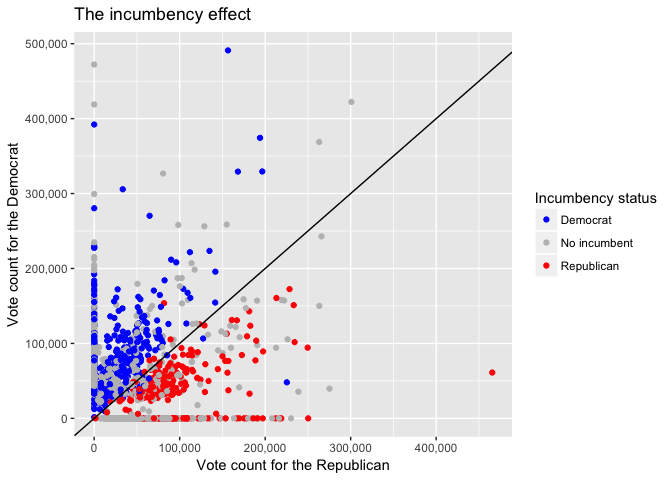
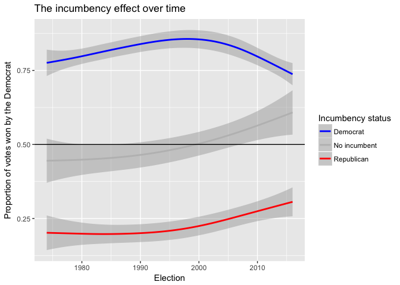

Forecasting the 2018 California Legislative Election
================
EJ Arce
4/2/2017

### Importing election results data

We are importing three datasets and we will eventually join them. LegResults6814 consists of every candidate who ran for a seat in the California State Legislature from 1968 to 2014. LegResults16 includes such candidates who ran in 2016. Threeoffices includes the voting totals for three US offices (Presidential, Gubernatorial, and US Senate) in each of the California senatorial and assembly districts, from 1966 to 2016. This dataset previously consisted of three separate datasets, which Jonathan and I cleaned in R or excel, to create threeoffices.

``` r
LegResults6814 <- read.dta("~/Desktop/state-forecasting-alpha/032_StateLegForecast_CAcopy/SLERs1967to2015_20160912b_CA.dta")

LegResults16 <- read_excel("~/Desktop/state-forecasting-alpha/032_StateLegForecast_CAcopy/001_CA2016GenOfficecopy.xls")

threeoffices <- read_excel("~/Desktop/state-forecasting-alpha/032_StateLegForecast_CAcopy/threeoffices662016copy.xlsx")
```

### Cleaning election results data

For both datasets, we want each observation to represent a given chamber's district's voting totals for both national and state legislative offices, each office including a democratic or republican candidate. It is certainly possible that some candidates for a legislative office ran unopposed or against a third-party candidate, resulting in some blank entries.

``` r
# Selecting and renaming variables of interest, and filtering the dataset to only include democratic and republican candidates. 

LegResults6814 <- LegResults6814 %>%
  select(v05, v07, v09z, v21, v22, v23) %>%
  rename(year = v05,
         chamber = v07,
         District = v09z,
         party = v21,
         incumbency = v22,
         votes = v23) %>%
  filter(party == c(100, 200))
LegResults6814$chamber <- ifelse(LegResults6814$chamber == 8, "SEN", "HS")
LegResults6814$party <- ifelse(LegResults6814$party == 100, "Dem", "Repub")
LegResults6814 <- aggregate(x = LegResults6814["votes"], by = LegResults6814[c("year", "chamber", "District", "party", "incumbency")], sum)

# Coding dummy variables prez_party (1 if the president is a Democrat, -1 if the president is a Republican) and mid_penalty (1 if the president is a Democrat, -1 if the president is a Republican, 0 if the year includes a presidential election).

threeoffices$prez_party <- ifelse(threeoffices$year %in% c(1968, 1978,1980,1994,1996,1998,2000,2010,2012,2014,2016), 1, -1)
threeoffices$mid_penalty <- ifelse(threeoffices$year %in% c(1968,1972,1976,1980,1984,1988,1992,1996,2000,2004,2008,2012, 2016), 0, ifelse(LegResults6814$year %in% c(1970,1974,1982,1986,1990,2002,2006), -1, 1))

# Coding for dummy variable incumbent (1 if the seat up for election is held by a democrat, -1 if held by a Republican, 0 if the seat is open).

LegResults6814 <- LegResults6814  %>%
  mutate(dummyparty = ifelse(party == "Dem", 1, -1)) %>%
  mutate(incumbentparty = dummyparty * incumbency) %>%
  spread(key = party, value = votes) %>%
  filter(year > 1972)
LegResults6814[is.na(LegResults6814)] <- 0

# Repeating the same steps for LegResults16

LegResults16 <- LegResults16 %>%
  select(v05, v07, v09, partyoriginal, v23, incumbency) %>%
  rename(year = v05,
         chamber = v07,
         District = v09,
         party = partyoriginal,
         votes = v23) %>%
  filter(party == c("Democratic", "Republican"))
LegResults16$chamber <- ifelse(LegResults16$chamber == 8, "SEN", "HS")
LegResults16$party <- ifelse(LegResults16$party == "Democratic", "Dem", "Repub")
LegResults16 <- aggregate(x = LegResults16["votes"], by = LegResults16[c("year", "chamber", "District", "party", "incumbency")], sum)
LegResults16 <- LegResults16  %>%
  mutate(dummyparty = ifelse(party == "Dem", 1, -1)) %>%
  mutate(incumbentparty = dummyparty * incumbency) %>%
  spread(key = party, value = votes) %>%
  filter(year > 1972)
LegResults16[is.na(LegResults16)] <- 0

head(LegResults6814)
```

    ##   year chamber District incumbency dummyparty incumbentparty   Dem Repub
    ## 1 1974      HS        3          0          1              0 41972     0
    ## 2 1974      HS        4          0         -1              0     0 36820
    ## 3 1974      HS        5          0          1              0 45873     0
    ## 4 1974      HS        6          0         -1              0     0 27665
    ## 5 1974      HS        6          1          1              1 64472     0
    ## 6 1974      HS        7          0         -1              0     0 33842

``` r
head(LegResults16)
```

    ##   year chamber District incumbency dummyparty incumbentparty    Dem  Repub
    ## 1 2016      HS        1          1         -1             -1      0 197166
    ## 2 2016      HS        2          1          1              1  32781      0
    ## 3 2016      HS        3          0          1              0 109521      0
    ## 4 2016      HS        3          1         -1             -1      0 178787
    ## 5 2016      HS        4          0         -1              0      0 100170
    ## 6 2016      HS        4          0          1              0 176279      0

We have selected variables of interest and created new variables that will be useful for our model. Each observation still represents how a district voted for each candidate, so we need to aggregate the votes in the republican and democrat candidate columns so that each observation represents how a district voted for both parties' candidates.

``` r
# Aggregating rows by votes so that our LegResults 6814 dataset is now a district's legislative election

LegResults6814 <- aggregate(x = LegResults6814[c("Dem",
                                                 "Repub",
                                                 "incumbency",
                                                 "incumbentparty",
                                                 "dummyparty")],
                            by = LegResults6814[c("year",
                                                  "chamber",
                                                  "District")],
                            sum)

LegResults16 <- aggregate(x = LegResults16[c("Dem",
                                             "Repub",
                                             "incumbency",
                                             "incumbentparty",
                                             "dummyparty")],
                          by = LegResults16[c("year",
                                              "chamber",
                                              "District")],
                          sum)
```

Our dataset on voting totals for presidential, gubernatorial, and US Senate offices was mostly tidy, and any modifications to it were made in excel. We now only need to select the variables of interest, remove unnecessary rows (some rows contained sidenotes for the data), and rename the district column to match with our legislative results dataset.

``` r
threeoffices <- threeoffices %>%
  filter(Dummy1 == 1,
         year > 1972) %>%
  select(year, chamber, dist, (17:24), prez_party, mid_penalty) %>%
  rename(District = dist)
```

Now both datasets are clean, and we will join them soon. However, first we need to add data on presidential approval ratings and percent change in real income (courtesy of Gallup and the Department of Commerce). Both datasets were collected at the national level.

### Importing and cleaning presidential approval and economy strength data

``` r
Econ_State2 <- read_excel("~/Desktop/state-forecasting-alpha/032_StateLegForecast_CAcopy/econ-strength.xls")
PrezApprove <- read_excel("~/Desktop/state-forecasting-alpha/032_StateLegForecast_CAcopy/Gallup_Prez_Approv_1966to2016.xlsx")

PrezApprove <- PrezApprove %>%
  select(Year, Approve) %>%
  rename(year = Year)

# For percent change in real income, we are using Dr. Klarner's weighted percent change formula. This includes attributing the highest weight to the most recent quarter. In our case, since we will test this model days before the election, the second quarter (July through September) will have the largest weight. The reason we are doing this is because we expect that voters focus more on how the economy has changed now, and less 10 months ago. First, we need to measure percent change for each quarter. Our dataset only gives raw income values, so the first mutation creates percent changes for each quarter, and our second mutation creates our weighted annual percent change.

Econ_State <- Econ_State2 %>%
  spread(key = Quarter, value = Income) %>%
  mutate(I_IIpercent = (II-I)/I,
         II_IIIpercent = (lag(III)-lag(II))/lag(II),
         III_IVpercent = (lag(IV)-lag(III))/lag(III),
         IV_Ipercent = (I - lag(IV))/lag(IV)) %>%
  mutate(perc_change = (3*I_IIpercent +
                        4*II_IIIpercent +
                        III_IVpercent +
                        2*IV_Ipercent)/10) %>%
  rename(year = Year)
```

### Joining legislative elections data with threeoffices, and joining Econ\_State and PrezApprove to Results

``` r
# First joining the legislative results from 2016 to legislative results from 1968 through 2014.

LegResults <- full_join(LegResults16, LegResults6814, by = c("year", "chamber", "District",  "Dem", "Repub", "incumbentparty", "incumbency", "dummyparty"))

# Joining the entire legislative results to US offices results.

Results <- full_join(LegResults, threeoffices, by = c("year", "chamber", "District"))

# Joining presidential approval and percent change in real income data to the Results. Also creating another presidential approval rating variable that multiplies the rating by -1 if the president is republican.

Results <- left_join(Results, Econ_State, by = "year")
Results <- left_join(Results, PrezApprove, by = "year")

# Importing 2018 empty data and joining it to include lagged effects.

df2018 <- read_excel("~/Desktop/state-forecasting-alpha/032_StateLegForecast_CAcopy/2018template.xlsx")

df2018 <- df2018 %>%
  mutate(prez_party = -1, mid_penalty = 1)

Results <- full_join(Results, df2018, by = c("year",
                                             "chamber",
                                             "District",
                                             "prez_party",
                                             "mid_penalty"))

# Adding another incumbent variable, this time to explicitly describe which party holds the incumbency. Also adding a categorical variable Leg_winner to represent which party captured the legislative seat.

Results <- Results %>%
  rename(Leg_Dem = Dem, Leg_Repub = Repub) %>%
  mutate(incumb_party_name = ifelse(incumbentparty == 1, "Democrat", ifelse(incumbentparty == 0, "No incumbent", "Republican")),
         Leg_winner = ifelse(Leg_Repub > Leg_Dem, "Republican", "Democract"),
         perc_Dem = Leg_Dem / (Leg_Dem + Leg_Repub),
         perc_Repub = Leg_Repub / (Leg_Dem + Leg_Repub)) %>%
  arrange(year, chamber, District) %>%
  mutate(perc_prez_Dem = Prez_Dem/(Prez_Dem + Prez_Repub),
         perc_sen_Dem = US_Sen_Dem/(US_Sen_Dem + US_Sen_Repub),
         perc_sen2_Dem = US_Sen2_Dem/(US_Sen2_Dem + US_Sen2_Repub),
         perc_gub_Dem = Gub_Dem/(Gub_Dem + Gub_Repub),
         Approve = Approve/100)
```

### Fully clean dataset

``` r
head(Results)
```

    ##   year chamber District Leg_Dem Leg_Repub incumbency incumbentparty
    ## 1 1974      HS        1      NA        NA         NA             NA
    ## 2 1974      HS        2      NA        NA         NA             NA
    ## 3 1974      HS        3   41972         0          0              0
    ## 4 1974      HS        4       0     36820          0              0
    ## 5 1974      HS        5   45873         0          0              0
    ## 6 1974      HS        6   64472     27665          1              1
    ##   dummyparty Prez_Dem Prez_Repub Gub_Dem Gub_Repub US_Sen_Dem US_Sen_Repub
    ## 1         NA       NA         NA   49033     45113      54624        35815
    ## 2         NA       NA         NA   51300     41867      58658        30320
    ## 3          1       NA         NA   41675     48068      49590        35463
    ## 4         -1       NA         NA   43442     38605      54781        25016
    ## 5          1       NA         NA   42013     38264      50049        27862
    ## 6          0       NA         NA   49335     43671      59964        30545
    ##   US_Sen2_Dem US_Sen2_Repub prez_party mid_penalty      I     II    III
    ## 1          NA            NA         -1           1 1204.4 1230.4 1266.6
    ## 2          NA            NA         -1           1 1204.4 1230.4 1266.6
    ## 3          NA            NA         -1           1 1204.4 1230.4 1266.6
    ## 4          NA            NA         -1           1 1204.4 1230.4 1266.6
    ## 5          NA            NA         -1           1 1204.4 1230.4 1266.6
    ## 6          NA            NA         -1          -1 1204.4 1230.4 1266.6
    ##     IV I_IIpercent II_IIIpercent III_IVpercent IV_Ipercent perc_change
    ## 1 1296  0.02158751    0.02440763    0.03321739  0.01363407  0.02228786
    ## 2 1296  0.02158751    0.02440763    0.03321739  0.01363407  0.02228786
    ## 3 1296  0.02158751    0.02440763    0.03321739  0.01363407  0.02228786
    ## 4 1296  0.02158751    0.02440763    0.03321739  0.01363407  0.02228786
    ## 5 1296  0.02158751    0.02440763    0.03321739  0.01363407  0.02228786
    ## 6 1296  0.02158751    0.02440763    0.03321739  0.01363407  0.02228786
    ##   Approve incumb_party_name Leg_winner  perc_Dem perc_Repub perc_prez_Dem
    ## 1    0.54              <NA>       <NA>        NA         NA            NA
    ## 2    0.54              <NA>       <NA>        NA         NA            NA
    ## 3    0.54      No incumbent  Democract 1.0000000  0.0000000            NA
    ## 4    0.54      No incumbent Republican 0.0000000  1.0000000            NA
    ## 5    0.54      No incumbent  Democract 1.0000000  0.0000000            NA
    ## 6    0.54          Democrat  Democract 0.6997406  0.3002594            NA
    ##   perc_sen_Dem perc_sen2_Dem perc_gub_Dem
    ## 1    0.6039872            NA    0.5208187
    ## 2    0.6592416            NA    0.5506241
    ## 3    0.5830482            NA    0.4643816
    ## 4    0.6865045            NA    0.5294770
    ## 5    0.6423868            NA    0.5233504
    ## 6    0.6625197            NA    0.5304496

### Importing CA shapefiles

To visualiza our data, we would like to include a map of California senatorial and assembly districts. The shapefiles necessary to do this were obtained from the Census Bureau.

``` r
SENshape <- readShapePoly("~/Desktop/state-forecasting-alpha/032_StateLegForecast_CAcopy/CA_SEN_shapefile/cb_2016_06_sldu_500k.shp")
HSshape <- readShapePoly("~/Desktop/state-forecasting-alpha/032_StateLegForecast_CAcopy/CA_HS_shapefile/cb_2016_06_sldl_500k.shp")

SENshapefort <- fortify(SENshape, region = "NAME")
HSshapefort <- fortify(HSshape, region = "NAME")
```

### Some visualizations

``` r
plot1 <- ggplot(Results, aes(y = Leg_Dem, x = Leg_Repub)) +
  geom_point(mapping = aes(col = incumb_party_name)) +
  scale_colour_manual(values = c("blue", "grey", "red")) +
  geom_abline(intercept = 0, slope = 1) +
  scale_y_continuous(name = "Vote count for the Democrat",
                     labels = comma) +
  scale_x_continuous(name = "Vote count for the Republican",
                     labels = comma) +
  labs(col = "Incumbency status") +
  ggtitle("The incumbency effect")
plot1
```



``` r
plot2 <- ggplot(Results, aes(y = perc_Dem, x = year)) +
  geom_smooth(mapping = aes(col = incumb_party_name)) +
  scale_colour_manual(values = c("blue", "grey", "red")) +
  geom_abline(intercept = .5, slope = 0) +
  ggtitle("The incumbency effect over time") +
  xlab("Election") +
  ylab("Proportion of votes won by the Democrat") +
  labs(col = "Incumbency status")
plot2
```



``` r
# Plot 2 shows that the incumbency advantage has diminished in the past two
# decades. Thus, in our model, we should vary the incumbency variable by time.
```

``` r
# Creating a subset of Results that only includes senatorial district voting totals in 2014.

SEN14 <- Results %>%
  filter(year == 2014, chamber == "SEN")

SEN14map <- ggplot() +
  geom_map(data = SEN14,
           aes(map_id = District, fill = perc_Dem),
           map = SENshapefort) +
  expand_limits(x = SENshapefort$long, y = SENshapefort$lat) +
  scale_fill_gradient2(low = muted("red"),
                       mid = "white", midpoint = .5,
                       high = muted("blue"),
                       limits = c(0, 1),
                       na.value = "grey") +
  labs(fill = "Proportion voting for a Democrat") +
  ggtitle("Voting outcomes in the 2014 California State Senate Election")
SEN14map
```


``` r
# Visualizing the relationship between econ-strength*prez_party and perc_Dem

plot3 <- ggplot(Results, aes(y = perc_Dem, x = perc_change)) +
  geom_smooth() +
  facet_grid(. ~ prez_party)
plot3
```


Create a Mixed Effects Model
----------------------------

``` r
# We need to code for NAs so that the observations used in our model will not
# be excluded if one of the variables we use include an NA. We will store these
# changes under a new dataset Resultsmodel. Also, we will code for lagged
# variables, which include observations for each variable from the previous
# election.

Results <- Results %>%
  mutate(perc_changeLag = lag(perc_change, 120),
         ApproveLag = lag(Approve, 120),
         incumbentpartyLag = lag(incumbentparty, 120),
         perc_DemLag = lag(perc_Dem, 120),
         perc_prez_DemLag = lag(perc_prez_Dem, 120),
         perc_gub_DemLag = lag(perc_gub_Dem, 120),
         perc_sen_DemLag = lag(perc_sen_Dem, 120))

Resultsmodel <- Results %>%
  mutate(perc_changeLag = lag(perc_change, 120),
         ApproveLag = lag(Approve, 120),
         incumbentpartyLag = lag(incumbentparty, 120),
         perc_DemLag = lag(perc_Dem, 120),
         perc_prez_DemLag = lag(perc_prez_Dem, 120),
         perc_gub_DemLag = lag(perc_gub_Dem, 120),
         perc_sen_DemLag = lag(perc_sen_Dem, 120))

Resultsmodel[c("Leg_Dem",
          "Leg_Repub",
          "Prez_Dem",
          "Prez_Repub",
          "incumbency",
          "incumbentparty",
          "dummyparty",
          "Gub_Dem",
          "Gub_Repub",
          "US_Sen_Dem",
          "US_Sen_Repub",
          "US_Sen2_Dem",
          "US_Sen2_Repub")][is.na(Resultsmodel[c("Leg_Dem",
                                      "Leg_Repub",
                                      "Prez_Dem",
                                      "Prez_Repub",
                                      "incumbency",
                                      "incumbentparty",
                                      "dummyparty",
                                      "Gub_Dem",
                                      "Gub_Repub",
                                      "US_Sen_Dem",
                                      "US_Sen_Repub",
                                      "US_Sen2_Dem",
                                      "US_Sen2_Repub")])] <- 0
Resultsmodel[c("perc_Dem",
          "perc_Repub",
          "perc_prez_Dem",
          "perc_sen_Dem",
          "perc_sen2_Dem",
          "perc_gub_Dem",
          "perc_prez_DemLag",
          "perc_gub_DemLag",
          "perc_sen_DemLag")][is.na(Resultsmodel[c("perc_Dem",
                                           "perc_Repub",
                                           "perc_prez_Dem",
                                           "perc_sen_Dem",
                                           "perc_sen2_Dem",
                                           "perc_gub_Dem",
                                           "perc_prez_DemLag",
                                           "perc_gub_DemLag",
                                           "perc_sen_DemLag")])] <- .0
Resultsmodel["Leg_winner"][is.na(Resultsmodel["Leg_winner"])] <- "No election"

Resultsmodel <- Resultsmodel %>%
  mutate(mid_penalty = prez_party*mid_penalty,
         Approve = prez_party*Approve) %>%
  mutate(chamdist = rep(1:120, times = 23))
```

``` r
m1 <- lmer(formula = perc_Dem ~ 
             perc_DemLag +
             incumbentparty +
             perc_change +
             (1|chamdist),
           data = Resultsmodel)
AIC(m1)
```

    ## [1] 989.3983

``` r
# Added perc_changeLag as fixed effect, and changed three offices covariates
# to lagged variables. This rose the AIC but is necessary because we are using
# last election's results to predict the next one.

m6 <- lmer(perc_Dem ~
             perc_DemLag + (1 + perc_DemLag|chamdist) +
             perc_prez_DemLag +
             perc_gub_DemLag +
             perc_sen_DemLag +
             incumbentpartyLag +
             incumbentparty + (1 + incumbentparty|year) +
             perc_change + 
             Approve + (1 + Approve|year) +
             mid_penalty,
           data = Resultsmodel)

m7 <- lmer(perc_Dem ~
             (1 + perc_DemLag||chamdist) +
             perc_prez_DemLag +
             incumbentpartyLag +
             incumbentparty + (1 + incumbentparty|year) +
             perc_change + 
             (1 + Approve|year),
           data = Resultsmodel) 
```

### Testing the model

``` r
# Creating two datasets; one to build the model, and one to test the model.
set.seed(23)
train_indeces <- sample(1:nrow(Resultsmodel), size = 1380, replace = FALSE)
default_train <- slice(Resultsmodel, train_indeces)
default_test <- slice(Resultsmodel, -train_indeces)
```

``` r
y6 <- predict(m6, newdata = default_test, type = "response", allow.new.levels = TRUE)
default_test <- default_test %>%
  mutate(p_hat6 = y6, pred_default6 = p_hat6 >.5)
confusion_mat6 <- default_test %>%
  group_by(perc_Dem, pred_default6) %>%
  tally()
false_pos6 <- confusion_mat6[2, 3]
false_neg6 <- confusion_mat6[4, 3]
total_obs6 <- nrow(default_test)
mcr6 <- (false_pos6 + false_neg6)/total_obs6
mcr6
```

    ##             n
    ## 1 0.001449275

New Model
---------

``` r
# Still need chamdist to indefity unique districts

Results1 <- Results %>%
  mutate(mid_penalty = prez_party*mid_penalty,
         Approve = prez_party*Approve) %>%
  mutate(chamdist = rep(1:120, times = 23))
```

``` r
Calc_err <- function(m1, initial_lag = 12){
  n <- length(unique(Results1$year))
  n_predict <- n - initial_lag -1
  RSS <- rep(NA, n = n_predict)
  for(i in 1:n_predict){
    train <- Results1 %>%
      filter(year < min(Results1$year) + 2*(initial_lag + i) - 1)
    test <- Results1 %>%
      filter(year == min(Results1$year) + 2*(initial_lag + i))
    m1 <- lmer(formula = perc_Dem ~
                 perc_DemLag +
                 incumbentparty +
                 perc_change +
                 (1|chamdist),
               data = train)
    y1 <- predict(m1 , data = test)
    y2 <- simulate(m1 , data = test)
    RSS[i] <- sum((test$perc_Dem - y2$perc_Dem)^2)
  }
  mean(RSS)}

Calc_err(m1)
```

    ## [1] 0
