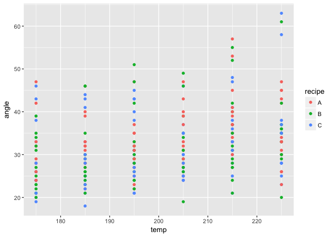

Untitled
================
Jonathan Matz
4/28/2017

### Model 1: Simple Non-Multilevel Models

``` r
Basic_OLS <- lm(incidence ~ size, cbpp)
summary(Basic_OLS)
```

    ## 
    ## Call:
    ## lm(formula = incidence ~ size, data = cbpp)
    ## 
    ## Residuals:
    ##     Min      1Q  Median      3Q     Max 
    ## -3.1456 -1.5925 -0.4864  0.8006  8.6840 
    ## 
    ## Coefficients:
    ##             Estimate Std. Error t value Pr(>|t|)   
    ## (Intercept) -0.31106    0.73554  -0.423  0.67405   
    ## size         0.13827    0.04389   3.150  0.00266 **
    ## ---
    ## Signif. codes:  0 '***' 0.001 '**' 0.01 '*' 0.05 '.' 0.1 ' ' 1
    ## 
    ## Residual standard error: 2.432 on 54 degrees of freedom
    ## Multiple R-squared:  0.1553, Adjusted R-squared:  0.1396 
    ## F-statistic: 9.926 on 1 and 54 DF,  p-value: 0.002657

``` r
display(Basic_OLS)
```

    ## lm(formula = incidence ~ size, data = cbpp)
    ##             coef.est coef.se
    ## (Intercept) -0.31     0.74  
    ## size         0.14     0.04  
    ## ---
    ## n = 56, k = 2
    ## residual sd = 2.43, R-Squared = 0.16

This model is not very informative, but it serves as the baseline ordinary least squares linear model for comparison. It should not end up being the best or representative model and it will not.

### Model 2: Varying Intercept Based on Cake Recipe

``` r
Basic_ME <- lmer(angle ~ temp + (1|recipe), cake)
summary(Basic_ME)
```

    ## Linear mixed model fit by REML ['lmerMod']
    ## Formula: angle ~ temp + (1 | recipe)
    ##    Data: cake
    ## 
    ## REML criterion at convergence: 1876.3
    ## 
    ## Scaled residuals: 
    ##     Min      1Q  Median      3Q     Max 
    ## -2.0632 -0.6593 -0.1955  0.4503  3.4747 
    ## 
    ## Random effects:
    ##  Groups   Name        Variance Std.Dev.
    ##  recipe   (Intercept)  0.08044 0.2836  
    ##  Residual             60.30516 7.7656  
    ## Number of obs: 270, groups:  recipe, 3
    ## 
    ## Fixed effects:
    ##             Estimate Std. Error t value
    ## (Intercept)  0.51587    5.55710   0.093
    ## temp         0.15803    0.02767   5.711
    ## 
    ## Correlation of Fixed Effects:
    ##      (Intr)
    ## temp -0.996

``` r
display(Basic_ME)
```

    ## lmer(formula = angle ~ temp + (1 | recipe), data = cake)
    ##             coef.est coef.se
    ## (Intercept) 0.52     5.56   
    ## temp        0.16     0.03   
    ## 
    ## Error terms:
    ##  Groups   Name        Std.Dev.
    ##  recipe   (Intercept) 0.28    
    ##  Residual             7.77    
    ## ---
    ## number of obs: 270, groups: recipe, 3
    ## AIC = 1884.3, DIC = 1866.3
    ## deviance = 1871.3

``` r
AIC(Basic_ME)
```

    ## [1] 1884.294

In short, this basically gives each observation, in this case, a given cake, a unique intercept based on its respective recipe (and how that recipe might influence the outcome). This is done using the (x|y) command where x is a given random effect and y is all the possible levels or factors of that effect and subsequently a unique intercept will be assigned to each possible combination. Since, in this case, we are just interested in recipes as opposed, say, recipes based on how well they are replicated (recipe|replicate) or some similar combination, then x is simply set to equal 1. The parentheses are necessary to specify that we are dealing with random effects and want to give each observation its unique inctercept. The most successful model should have the lowest AIC value.

### Model 3: Multiple Group Effects

``` r
Basic_ME2 <- lmer(angle ~ temp + (1|recipe) + (1|replicate), cake)
summary(Basic_ME2)
```

    ## Linear mixed model fit by REML ['lmerMod']
    ## Formula: angle ~ temp + (1 | recipe) + (1 | replicate)
    ##    Data: cake
    ## 
    ## REML criterion at convergence: 1670
    ## 
    ## Scaled residuals: 
    ##     Min      1Q  Median      3Q     Max 
    ## -2.9952 -0.5716 -0.0180  0.5578  2.8445 
    ## 
    ## Random effects:
    ##  Groups    Name        Variance Std.Dev.
    ##  replicate (Intercept) 39.2062  6.2615  
    ##  recipe    (Intercept)  0.4931  0.7022  
    ##  Residual              23.1624  4.8127  
    ## Number of obs: 270, groups:  replicate, 15; recipe, 3
    ## 
    ## Fixed effects:
    ##             Estimate Std. Error t value
    ## (Intercept)  0.51587    3.82478   0.135
    ## temp         0.15803    0.01715   9.215
    ## 
    ## Correlation of Fixed Effects:
    ##      (Intr)
    ## temp -0.897

``` r
display(Basic_ME2)
```

    ## lmer(formula = angle ~ temp + (1 | recipe) + (1 | replicate), 
    ##     data = cake)
    ##             coef.est coef.se
    ## (Intercept) 0.52     3.82   
    ## temp        0.16     0.02   
    ## 
    ## Error terms:
    ##  Groups    Name        Std.Dev.
    ##  replicate (Intercept) 6.26    
    ##  recipe    (Intercept) 0.70    
    ##  Residual              4.81    
    ## ---
    ## number of obs: 270, groups: replicate, 15; recipe, 3
    ## AIC = 1680, DIC = 1663.2
    ## deviance = 1666.6

``` r
AIC(Basic_ME2)
```

    ## [1] 1680.048

The model is not restricted to one group effect (i.e. more than one term can be used to identify the unique intercept). In this case I used replicate (which is a factored variable that takes values between 1 and 15), because it was the only remaining variable, but also to see if it would improve the fitness of the model. The effect of including 'period' as one of the group effects that determined the unique intercept was fairly large as it only decreased the AIC from ~1884 to ~1680 between models Basic\_ME and Basic\_ME2. While the AIC is still very large overall, which makes sense given the type of variables we are dealing with (see visualization below), this shows that the (1|replicate) term does lead to a more fit model, if only slightly.

``` r
Viz1 <- ggplot(cake, aes(temp, angle, color = recipe)) + geom_point()
Viz1
```



### Model 4: Intercept Varying Among Recipe and (Replicate within Recipe)

``` r
# (1|recipe/replicate) = (1|recipe) + (1|recipe:replicate)

Basic_ME3 <- lmer(angle ~ temp + (1|recipe/replicate), cake)
summary(Basic_ME3)
```

    ## Linear mixed model fit by REML ['lmerMod']
    ## Formula: angle ~ temp + (1 | recipe/replicate)
    ##    Data: cake
    ## 
    ## REML criterion at convergence: 1701.3
    ## 
    ## Scaled residuals: 
    ##      Min       1Q   Median       3Q      Max 
    ## -2.43433 -0.58880 -0.08713  0.59933  2.67694 
    ## 
    ## Random effects:
    ##  Groups           Name        Variance Std.Dev.
    ##  replicate:recipe (Intercept) 40.25    6.344   
    ##  recipe           (Intercept)  0.00    0.000   
    ##  Residual                     20.71    4.551   
    ## Number of obs: 270, groups:  replicate:recipe, 45; recipe, 3
    ## 
    ## Fixed effects:
    ##             Estimate Std. Error t value
    ## (Intercept)  0.51587    3.38958   0.152
    ## temp         0.15803    0.01622   9.746
    ## 
    ## Correlation of Fixed Effects:
    ##      (Intr)
    ## temp -0.957

``` r
display(Basic_ME3)
```

    ## lmer(formula = angle ~ temp + (1 | recipe/replicate), data = cake)
    ##             coef.est coef.se
    ## (Intercept) 0.52     3.39   
    ## temp        0.16     0.02   
    ## 
    ## Error terms:
    ##  Groups           Name        Std.Dev.
    ##  replicate:recipe (Intercept) 6.34    
    ##  recipe           (Intercept) 0.00    
    ##  Residual                     4.55    
    ## ---
    ## number of obs: 270, groups: replicate:recipe, 45; recipe, 3
    ## AIC = 1711.3, DIC = 1692.1
    ## deviance = 1696.7

``` r
AIC(Basic_ME3)
```

    ## [1] 1711.298

ME2 above was slightly different in that its two intercept terms were such that it contained an intercept varying among recipe and replicate. This model is very similar, but the second intercept term accounts for specific replicate values within each recipe. In other words, a unique intercept is being fit based on 2 factors: 1) specific recipes and 2) the replicate values within these recipes rather than just replicate values in general. This model is slightly less of a fit model than Basic\_ME2 as it contains a higher AIC. The AIC model just measures how effective of a model Basic\_ME3 is relative to other potential fixe effect models dealing with the data. The AIC will probably never be 0 or close to it, but the goal is to keep it as low as possible.

### Model 5: Varying Slope (and Random Intercept)

``` r
ME <- lmer(angle ~ recipe + (recipe|replicate), cake)
summary(ME)
```

    ## Linear mixed model fit by REML ['lmerMod']
    ## Formula: angle ~ recipe + (recipe | replicate)
    ##    Data: cake
    ## 
    ## REML criterion at convergence: 1721
    ## 
    ## Scaled residuals: 
    ##      Min       1Q   Median       3Q      Max 
    ## -2.63714 -0.69483 -0.08998  0.65507  2.87191 
    ## 
    ## Random effects:
    ##  Groups    Name        Variance Std.Dev. Corr     
    ##  replicate (Intercept) 25.697   5.069             
    ##            recipeB      6.079   2.465    0.54     
    ##            recipeC     11.729   3.425    0.42 0.99
    ##  Residual              28.753   5.362             
    ## Number of obs: 270, groups:  replicate, 15
    ## 
    ## Fixed effects:
    ##             Estimate Std. Error t value
    ## (Intercept)   33.122      1.426  23.232
    ## recipeB       -1.478      1.022  -1.446
    ## recipeC       -1.522      1.192  -1.277
    ## 
    ## Correlation of Fixed Effects:
    ##         (Intr) recipB
    ## recipeB 0.090        
    ## recipeC 0.098  0.720

``` r
display(ME)
```

    ## lmer(formula = angle ~ recipe + (recipe | replicate), data = cake)
    ##             coef.est coef.se
    ## (Intercept) 33.12     1.43  
    ## recipeB     -1.48     1.02  
    ## recipeC     -1.52     1.19  
    ## 
    ## Error terms:
    ##  Groups    Name        Std.Dev. Corr      
    ##  replicate (Intercept) 5.07               
    ##            recipeB     2.47     0.54      
    ##            recipeC     3.42     0.42 0.99 
    ##  Residual              5.36               
    ## ---
    ## number of obs: 270, groups: replicate, 15
    ## AIC = 1741, DIC = 1732.6
    ## deviance = 1726.8

``` r
AIC(ME)
```

    ## [1] 1741.003

This model deals with a random intercept and a slope that is correlated to that random intercept. The (recipe|replicate) command or x + (x|y) command tells R to assign a random intercept to each obeservation based on replicate values but this time it also tell it to assign a random slope for different replicate levels. Additionally, the slope of recipe will now vary according to the different replicate values/levels associated with it, so there is now some correlated between the recipe and replicate variables and therefore the slope of recipe will be correlated with the random intercept for replicate. In other words, the slope for x conditional on y is somewhat correlated with the random intercept for y. This model is fairly decent, as it has a somwhat low, but still relatively middling, AIC value. Thus, it seems thus far that Basic\_ME2 is the most effective model for the given data.

### Model 6: Uncorrelated Slope (and Random Intercept)

``` r
ME2 <- lmer(angle ~ recipe + (recipe||replicate), cake)
summary(ME2)
```

    ## Linear mixed model fit by REML ['lmerMod']
    ## Formula: angle ~ recipe + ((1 | replicate) + (0 + recipe | replicate))
    ##    Data: cake
    ## 
    ## REML criterion at convergence: 1721
    ## 
    ## Scaled residuals: 
    ##      Min       1Q   Median       3Q      Max 
    ## -2.63714 -0.69483 -0.08998  0.65507  2.87191 
    ## 
    ## Random effects:
    ##  Groups      Name        Variance Std.Dev. Corr     
    ##  replicate   (Intercept)  0.00    0.000             
    ##  replicate.1 recipeA     25.70    5.069             
    ##              recipeB     45.29    6.730    0.95     
    ##              recipeC     51.99    7.211    0.90 0.99
    ##  Residual                28.75    5.362             
    ## Number of obs: 270, groups:  replicate, 15
    ## 
    ## Fixed effects:
    ##             Estimate Std. Error t value
    ## (Intercept)   33.122      1.426  23.232
    ## recipeB       -1.478      1.022  -1.446
    ## recipeC       -1.522      1.192  -1.277
    ## 
    ## Correlation of Fixed Effects:
    ##         (Intr) recipB
    ## recipeB 0.090        
    ## recipeC 0.098  0.720

``` r
display(ME2)
```

    ## lmer(formula = angle ~ recipe + ((1 | replicate) + (0 + recipe | 
    ##     replicate)), data = cake)
    ##             coef.est coef.se
    ## (Intercept) 33.12     1.43  
    ## recipeB     -1.48     1.02  
    ## recipeC     -1.52     1.19  
    ## 
    ## Error terms:
    ##  Groups      Name        Std.Dev. Corr      
    ##  replicate   (Intercept) 0.00               
    ##  replicate.1 recipeA     5.07               
    ##              recipeB     6.73     0.95      
    ##              recipeC     7.21     0.90 0.99 
    ##  Residual                5.36               
    ## ---
    ## number of obs: 270, groups: replicate, 15
    ## AIC = 1743, DIC = 1732.6
    ## deviance = 1726.8

``` r
AIC(ME2)
```

    ## [1] 1743.003

This command assigns random intercepts for each replicate level or factor level (like all the previously shown models) and like ME, it assigns a random slope to each level/value of both recipe and replicate, but the slope for recipe will not be correlated with any respective replicate values to which it applies. One odd thing to note is that correlation values are much closer to 1 for this model than they are for the model where there was supposed to be correlation between the slope and intercept. Additionally, there are minimal effects on the AIC value between this model and ME as the AIC increased from ~1741 to ~1743.

### Miscellaneous:

``` r
ME <- lmer(angle ~ temp + (recipe|replicate), cake)
summary(ME)
```

    ## Linear mixed model fit by REML ['lmerMod']
    ## Formula: angle ~ temp + (recipe | replicate)
    ##    Data: cake
    ## 
    ## REML criterion at convergence: 1652.1
    ## 
    ## Scaled residuals: 
    ##      Min       1Q   Median       3Q      Max 
    ## -2.52482 -0.56354 -0.01992  0.62526  2.60411 
    ## 
    ## Random effects:
    ##  Groups    Name        Variance Std.Dev. Corr     
    ##  replicate (Intercept) 26.96    5.192             
    ##            recipeB      8.49    2.914    0.40     
    ##            recipeC     15.32    3.914    0.30 0.99
    ##  Residual              20.57    4.535             
    ## Number of obs: 270, groups:  replicate, 15
    ## 
    ## Fixed effects:
    ##             Estimate Std. Error t value
    ## (Intercept)  1.77206    3.52721   0.502
    ## temp         0.15803    0.01616   9.779
    ## 
    ## Correlation of Fixed Effects:
    ##      (Intr)
    ## temp -0.916

``` r
display(ME)
```

    ## lmer(formula = angle ~ temp + (recipe | replicate), data = cake)
    ##             coef.est coef.se
    ## (Intercept) 1.77     3.53   
    ## temp        0.16     0.02   
    ## 
    ## Error terms:
    ##  Groups    Name        Std.Dev. Corr      
    ##  replicate (Intercept) 5.19               
    ##            recipeB     2.91     0.40      
    ##            recipeC     3.91     0.30 0.99 
    ##  Residual              4.53               
    ## ---
    ## number of obs: 270, groups: replicate, 15
    ## AIC = 1670.1, DIC = 1644.3
    ## deviance = 1648.2

``` r
AIC(ME)
```

    ## [1] 1670.132

The intercept form (g1|g2) was not on the webpage I checked, nor was it in the pdf Andrew gave us, but it seems to lead to a relatively effective model as the AIC is relatively low (1670).

### Some Visualizations:

### Main Takeaway:

The best lme model will have the lowest AIC. As shown abov, there are numerous different models we can use, but the issue is that this will grow more complex with more variables at our hand (as opposed to 3 simple variables) and there does not seem to be an efficient way to find out from the get go which lme model will lead to the lowest AIC value or will serve as the most accurate predictor. This may take some toying around initially.
